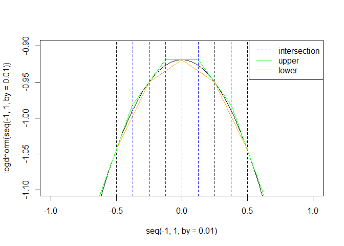

# Project_example
Chih-Hui(Jason) Wang  
November 21, 2015  


# Standard normal distribution as example


```r
#Standard normal(log scale)
logdnorm <- function(x){
  -x^2/2 - log(2*pi)/2
}

#Derivative
logddnorm <- function(x){
  -x
}
```

# Main function pseudo code

```r
experiment <- function(n, k, density_fun, ddensity_fun){
  #Initital value
  x <- seq(-0.5, 0.5, length.out=k)
  
  #z
  z <- (logdnorm(x[-1]) - logdnorm(x[-k]) - x[-1]*logddnorm(x[-1]) + x[-k]*logddnorm(x[-k]))/(logddnorm(x[-k]) - logddnorm(x[-1]))
  
  #Compute u
  
  #Compute s
  
  #Compute l
  
  #Sampling step for x_star
  
  #Sampling step for w
  
  #Reject or not
  
  #Updating step
  
  #Output
  
}
```

# u and l function

```r
#Function generate z
zfun <- function(x, fun, fun_deriv){
  (fun(x[-1]) - fun(x[-k]) - x[-1]*fun_deriv(x[-1]) + x[-k]*fun_deriv(x[-k]))/(fun_deriv(x[-k]) - fun_deriv(x[-1]))
}

u <- function(x1, x, z, fun, fun_deriv){
  #Construct upper and lower bound
  z <- c(-Inf, z, Inf)
  
  #Grouping
  group <- cut(x1, breaks=z, labels=1:length(x))
  #Check which group the x1 locate
  xj <- x[as.numeric(group)]
  
  #Compute value, slope and intercept
  value <- fun(xj) + (x1 - xj)*fun_deriv(xj)
  a <- fun_deriv(x1)
  b <- fun(x1) - a*x1
  
  out <- list(parameter=cbind(a, b), u=value)
  out
}

l <- function(x1, x, fun){
  #Grouping
  group <- cut(x1, breaks=x, labels=1:(length(x) - 1))
  #Check which group the x1 locate
  xj <- x[as.numeric(group)]
  xjplus <- x[as.numeric(group) + 1]
  
  #Compute value
  all <- ((xjplus - x1)*fun(xj) + (x1 - xj)*fun(xjplus))/(xjplus - xj)
  all[is.na(all)] <- -Inf
  
  all
}
```

# Visualization


```r
#Initial point -0.5, 0.5
#5 abscissaes
k <- 5
x <- seq(-0.5, 0.5, length.out=k)
#Compute z
z <- zfun(x, logdnorm, logddnorm)
```

### Intersection, upper and lower


```r
#Density
plot(seq(-1, 1, by=0.01), logdnorm(seq(-1, 1, by=0.01)), type="l", ylim=c(-1.1, -0.9))

#Abscissae
abline(v=x, lty=2)
#Intersect
abline(v=z, lty=2, col="blue")

#Add upper and lower
x1 <- seq(-1, 1, by=0.01)
lines(x1, u(x1, x, z, logdnorm, logddnorm)$u, col="green")
lines(x1, l(x1, x, logdnorm), col="orange")

legend("topright", lty=c(2, 1, 1), col=c("blue","green","orange"), legend=c("intersection", "upper", "lower"))
```



