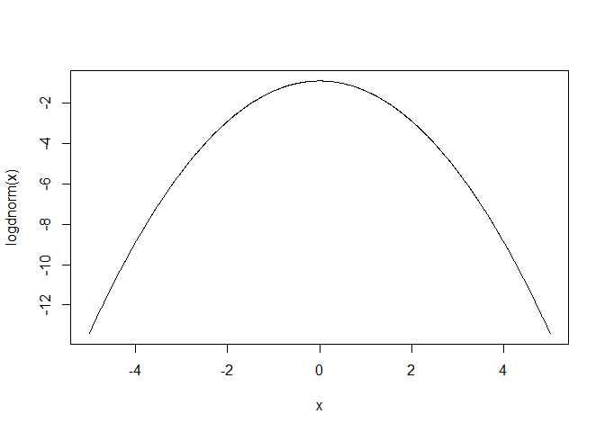
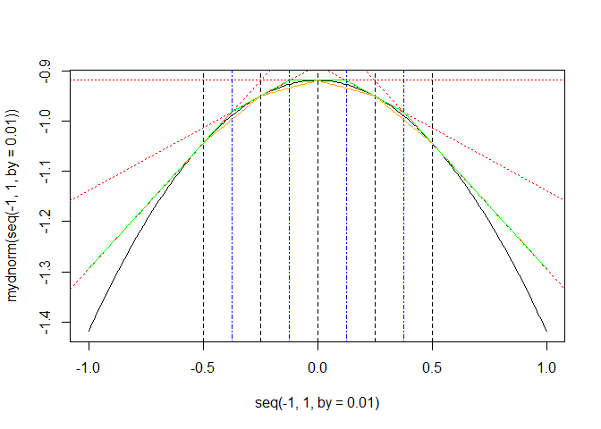
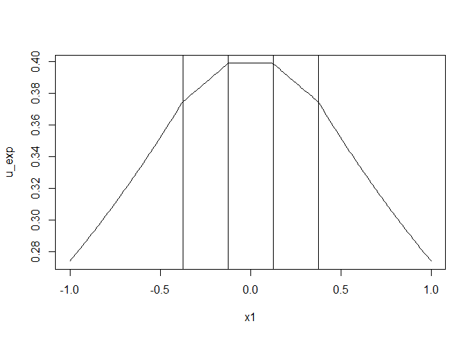

# Project_example
Chih-Hui(Jason) Wang  
November 21, 2015  


# Standard normal distribution as example


```r
#Standard normal(log scale)
logdnorm <- function(x){
  -x^2/2 - log(2*pi)/2
}

#Derivative
logddnorm <- function(x){
  -x
}

x <- seq(-5, 5, 0.01)
plot(x, logdnorm(x), type="l")
```



# Main function pseudo code

```r
experiment <- function(n, k, density_fun, ddensity_fun){
  #Initital value
  x <- seq(-0.5, 0.5, length.out=k)
  
  #z
  z <- (logdnorm(x[-1]) - logdnorm(x[-k]) - x[-1]*logddnorm(x[-1]) + x[-k]*logddnorm(x[-k]))/(logddnorm(x[-k]) - logddnorm(x[-1]))
  
  #Compute u
  
  #Compute s
  
  #Compute l
  
  #Sampling step for x_star
  
  #Sampling step for w
  
  #Reject or not
  
  #Updating step
  
  #Output
  
}
```

# u and l function

```r
u <- function(x1, z){
  #Construct upper and lower bound
  z <- c(-Inf, z, Inf)
  
  #Grouping
  group <- cut(x1, breaks=z)
  #Check which group the x1 locate
  xj <- x[which(group == levels(group))]
  
  #Compute value
  logdnorm(xj) + (x1 - xj)*logddnorm(xj)
}

l <- function(x1, x){
  #Grouping
  group <- cut(x1, breaks=x)
  #Check which group the x1 locate
  xj <- x[which(group == levels(group))]
  xjplus <- x[which(group == levels(group)) + 1]
  
  #Compute value
  all <- ((xjplus - x1)*logdnorm(xj) + (x1 - xj)*logdnorm(xjplus))/(xjplus - xj)
  ifelse(identical(numeric(0), all),
         -Inf,
         all)
}
```

# Visualization


```r
#Initial point -0.5, 0.5
#5 abscissaes
k <- 5
x <- seq(-0.5, 0.5, length.out=k)
#Compute z
z <- (logdnorm(x[-1]) - logdnorm(x[-k]) - x[-1]*logddnorm(x[-1]) + x[-k]*logddnorm(x[-k]))/(logddnorm(x[-k]) - logddnorm(x[-1]))
```


```r
#function to plot tangent line and intersection
plot.z <- function(x){
  slope <- logddnorm(x)
  intercept <- -(slope*x - logdnorm(x))
  
  for(i in 1:length(slope)){
    abline(a=intercept[i], b=slope[i], lty=3, col="red")
  }

  z <- (logdnorm(x[-1]) - logdnorm(x[-k]) - x[-1]*logddnorm(x[-1]) + x[-k]*logddnorm(x[-k]))/(logddnorm(x[-k]) - logddnorm(x[-1]))
  
  abline(v=z, col="blue", lty=4)
}
```

### Intersection, upper and lower


```r
#Density
plot(seq(-1, 1, by=0.01), logdnorm(seq(-1, 1, by=0.01)), type="l", ylim=c(-1.1, -0.9))

#Abscissae
abline(v=x, lty=2)
#Intersect
abline(v=z, lty=2, col="blue")

#Add upper and lower
x1 <- seq(-1, 1, by=0.01)
lines(x1, sapply(x1, u, z), col="green")
lines(x1, sapply(x1, l, x), col="orange")

legend("topright", lty=c(2, 1, 1), col=c("blue","green","orange"), legend=c("intersection", "upper", "lower"))
```



### Exponential of u function


```r
u_exp <- exp(sapply(x1, u, z))
plot(x1, u_exp, type="l")
abline(v=z)
```



